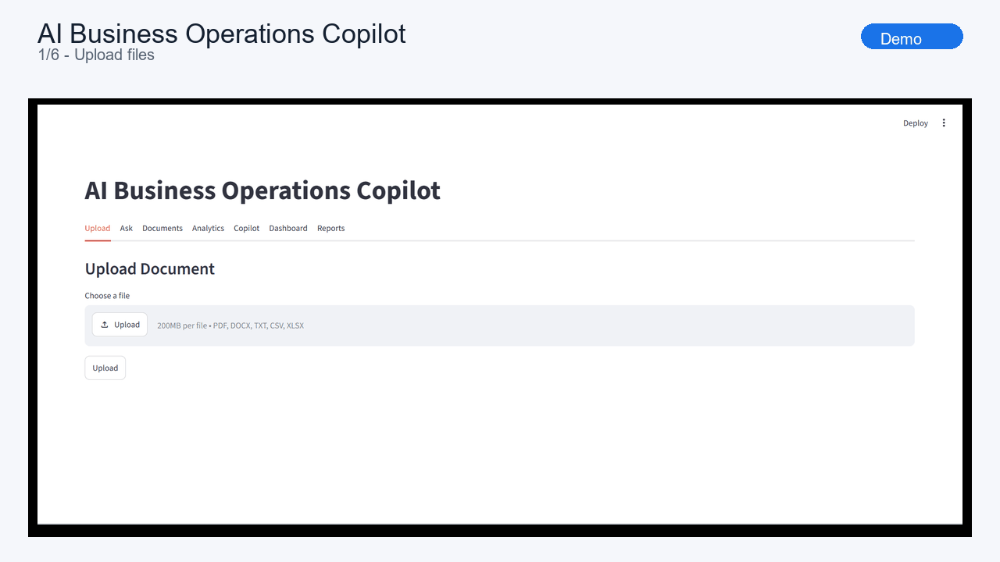
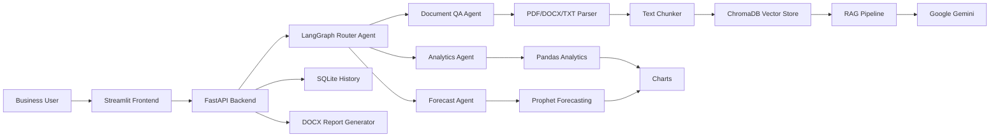
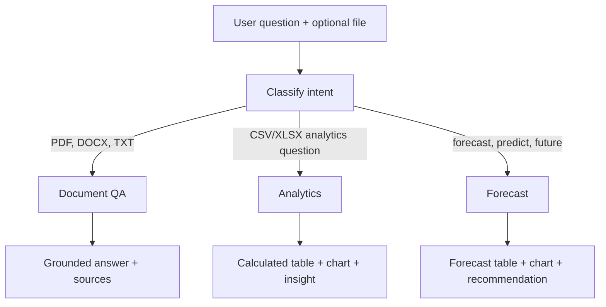
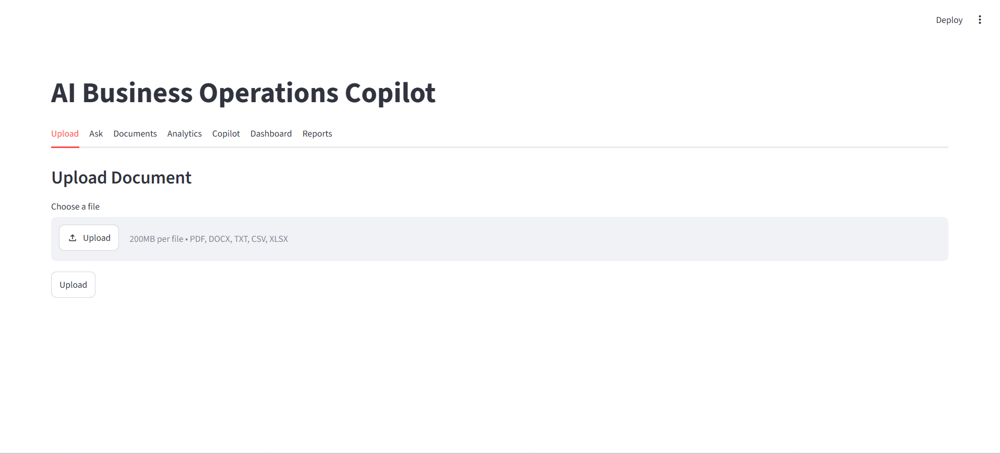
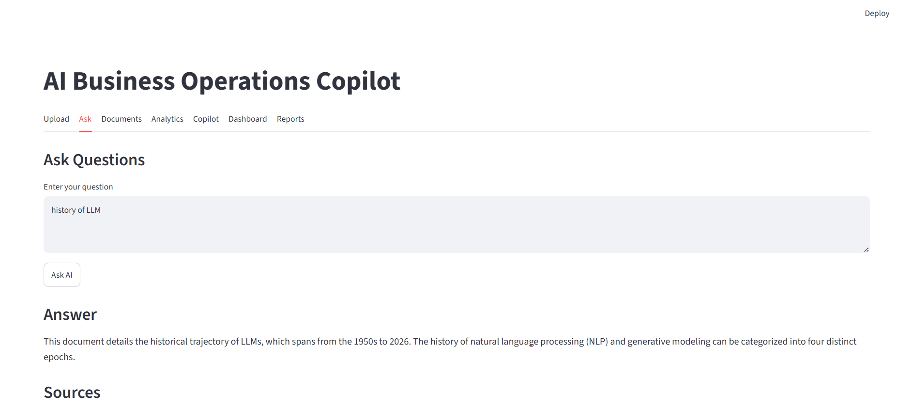
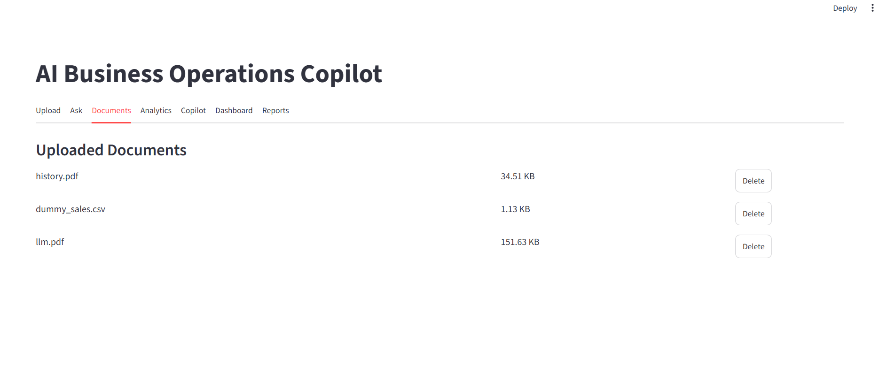
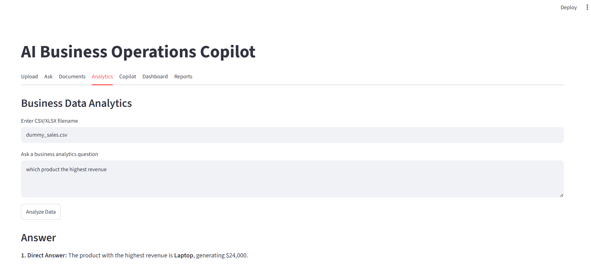
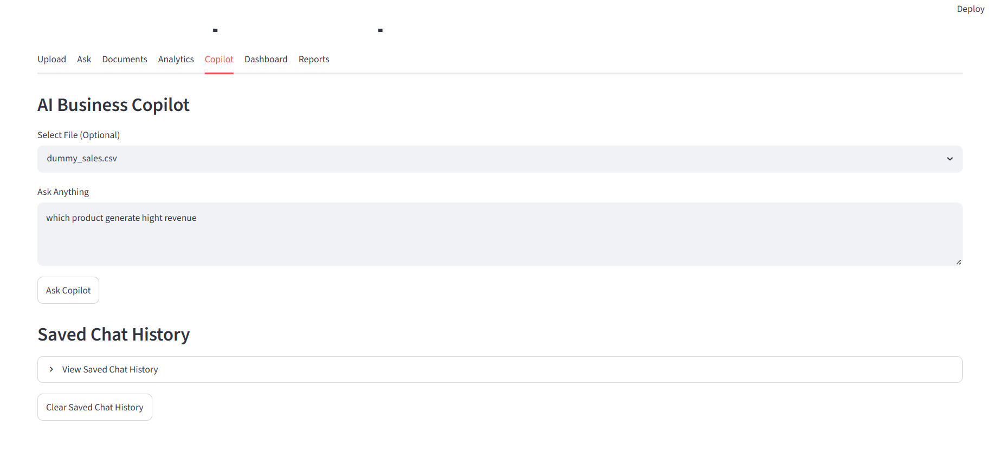
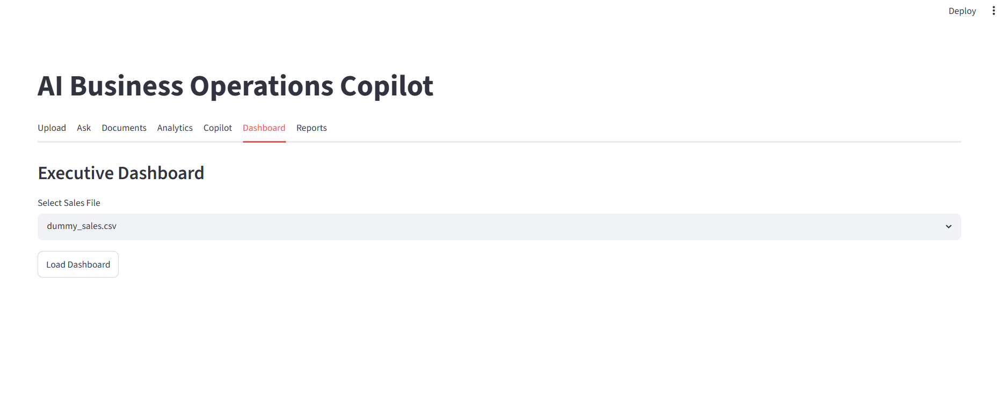
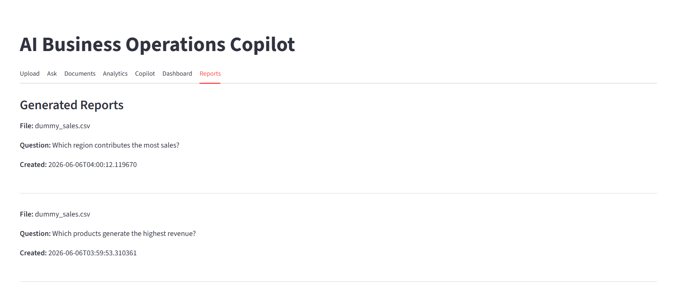

# AI Business Operations Copilot

An end-to-end AI operations workspace for business documents, sales datasets, forecasting, dashboards, and executive report generation.

This project is built as a portfolio-grade AI application, not a single chatbot demo. It combines RAG document intelligence, deterministic analytics, forecasting, a LangGraph routing layer, persistent history, and downloadable DOCX reports behind a FastAPI backend and Streamlit frontend.

## Demo

| Item | Link |
| --- | --- |
| Demo video | Add Loom or YouTube link after recording |
| Architecture details | [docs/ARCHITECTURE.md](docs/ARCHITECTURE.md) |
| Demo recording script | [docs/DEMO_VIDEO.md](docs/DEMO_VIDEO.md) |
| Screenshots | [assets/screenshots](assets/screenshots) |



## What It Does

- Upload business documents: PDF, DOCX, TXT
- Upload business datasets: CSV, XLSX
- Ask document questions using Retrieval-Augmented Generation
- Route natural-language requests to document QA, analytics, or forecasting
- Analyze sales, product, customer, region, and revenue trends
- Forecast future revenue with Prophet
- Generate KPI dashboards with Plotly
- Create downloadable DOCX executive reports
- Persist chat history and report history in SQLite

## Why This Project Matters

Most AI portfolio projects stop at a chat box. This one demonstrates how an AI assistant can be integrated into a business operations workflow:

- LLMs are used for summarization, answers, and executive recommendations.
- Pandas and Prophet perform the business calculations.
- LangGraph routes user intent to the right specialist agent.
- ChromaDB stores document embeddings for grounded retrieval.
- FastAPI exposes the backend as a real service.
- Streamlit gives business users a usable interface.
- Docker Compose runs the full stack locally.

## System Architecture



## Agent Routing Flow



## Screenshots

| Upload | Document QA | Analytics |
| --- | --- | --- |
|  |  |  |

| Copilot | Dashboard | Report History |
| --- | --- | --- |
|  |  |  |

| Generated Report |
| --- |
|  |

## Tech Stack

| Layer | Tools |
| --- | --- |
| Frontend | Streamlit, Plotly |
| Backend API | FastAPI, Uvicorn |
| Agent workflow | LangGraph |
| LLM | Google Gemini |
| RAG | ChromaDB, Sentence Transformers |
| Analytics | Pandas, NumPy |
| Forecasting | Prophet |
| Reports | python-docx |
| Persistence | SQLite |
| Deployment | Docker, Docker Compose |

## Repository Structure

```text
.
|-- backend/
|   |-- main.py              # FastAPI routes
|   |-- router_agent.py      # LangGraph intent router
|   |-- rag.py               # Retrieval QA pipeline
|   |-- analytics_agent.py   # Analytics and forecasting
|   |-- report_generator.py  # DOCX report generation
|   `-- database.py          # SQLite persistence
|-- frontend/
|   `-- app.py               # Streamlit interface
|-- assets/
|   `-- screenshots/         # GitHub README screenshots
|-- docs/
|   |-- ARCHITECTURE.md
|   `-- DEMO_VIDEO.md
|-- docker-compose.yml
|-- requirements.txt
`-- README.md
```

## Run Locally

### 1. Clone

```bash
git clone https://github.com/safdarmunir/ai-business-operations-copilot.git
cd ai-business-operations-copilot
```

### 2. Configure Environment

Create `.env` from the example file:

```bash
cp .env.example .env
```

Then add your Gemini API key:

```env
GEMINI_API_KEY=your_gemini_api_key_here
```

### 3. Start With Docker Compose

```bash
docker compose up --build
```

Open:

- Frontend: `http://localhost:8501`
- Backend docs: `http://localhost:8000/docs`

## API Surface

| Endpoint | Purpose |
| --- | --- |
| `POST /upload` | Upload documents or datasets |
| `POST /ask` | Ask document-grounded questions |
| `POST /analyze` | Analyze uploaded CSV/XLSX data |
| `POST /copilot` | Route a question through the multi-agent copilot |
| `POST /dashboard` | Return KPI summary metrics |
| `POST /dashboard-data` | Return chart-ready dashboard data |
| `POST /generate-report` | Generate DOCX executive reports |
| `GET /chat-history` | Read saved copilot history |
| `GET /reports` | Read generated report history |

## Example Demo Flow

1. Upload a PDF business document and ask a grounded question.
2. Upload `dummy_sales.csv`.
3. Ask: `Which products generate the highest revenue?`
4. Ask: `Forecast the next 3 months of revenue.`
5. Open the dashboard and review KPIs.
6. Generate and download an executive DOCX report.

## Interview Talking Points

- Designed a multi-agent workflow with LangGraph routing instead of a single prompt chain.
- Combined RAG, analytics, forecasting, dashboards, and report generation in one product surface.
- Separated LLM reasoning from deterministic business calculations.
- Added persistent chat/report history for a more production-like user experience.
- Packaged the app with Docker Compose for repeatable local deployment.

## Roadmap

- Authentication and user-specific workspaces
- PostgreSQL-backed persistence
- Cloud deployment with public demo URL
- Scheduled report generation
- Role-based access control
- More robust analytics intent parsing
- Automated tests for API routes and agent routing

## Author

Safdar Munir

AI Engineer | Machine Learning | Generative AI | LLM Applications
