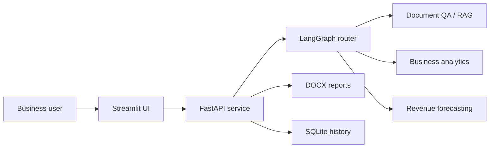
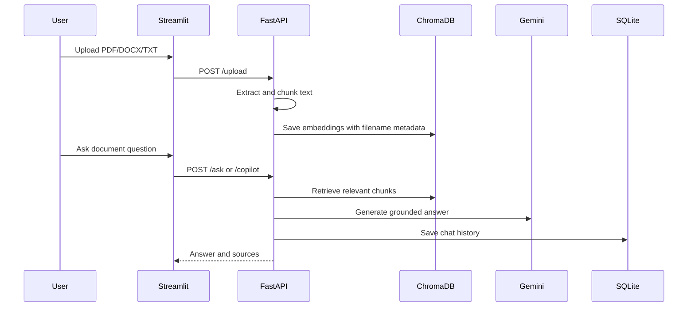
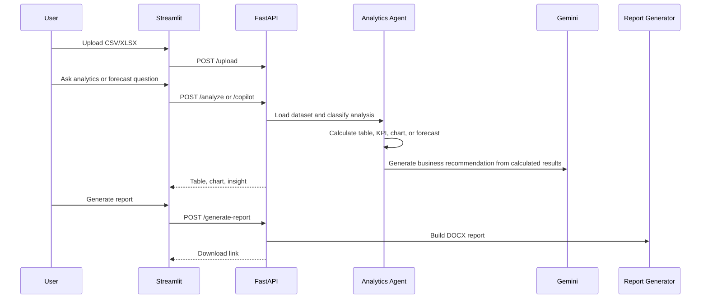

# Architecture

AI Business Operations Copilot is organized as a service-backed AI workflow: Streamlit handles the user experience, FastAPI exposes application endpoints, and specialist backend modules handle document intelligence, analytics, forecasting, persistence, and reporting.

## High-Level Flow

## Data And Document Flow

## Analytics And Forecasting Flow

## Agent Responsibilities

| Component | Responsibility |
| --- | --- |
| `RouterAgent` | Classifies questions and routes to document QA, analytics, or forecasting |
| `RAGPipeline` | Retrieves relevant document chunks and asks Gemini for grounded answers |
| `AnalyticsAgent` | Loads CSV/XLSX data, calculates business metrics, builds charts, and creates recommendations |
| `ReportGenerator` | Converts analysis output into downloadable DOCX executive reports |
| `database.py` | Stores chat history and report history in SQLite |

## Production Notes

- Uploaded files, generated charts, generated reports, and SQLite data are runtime artifacts and should be persisted with a mounted volume in production.
- The current MVP uses filename-based selection. A production version should add user-scoped file IDs and authentication.
- LLM output is used for interpretation and narrative recommendations, while numeric calculations are handled with Pandas and Prophet.
- For a public hosted deployment, add CORS controls, authentication, rate limiting, and secret management.
